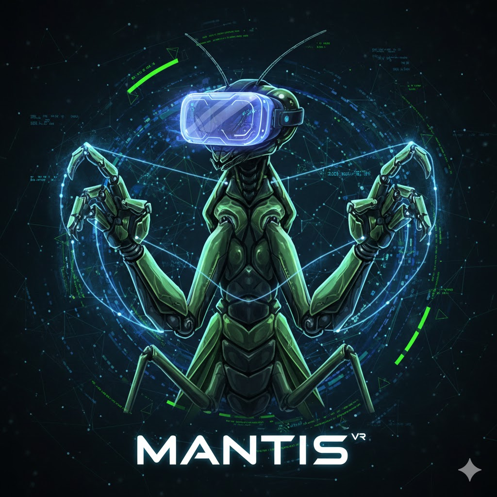

# MANTIS
Mutli-Arm Networked Teleoperation Interface System




### Development

```bash
"""
Received from client (example):
{
"left": {"grip": 0.0, "trigger": 0.0, "valid": true, "x": 0.1283, "y": 0.4193, "z": -0.1008},
"right": {"grip": 0.0, "trigger": 0.0, "valid": true, "x": 0.1871, "y": 0.4661, "z": -0.00516},
"type": "controller_positions"
}
"""
```
